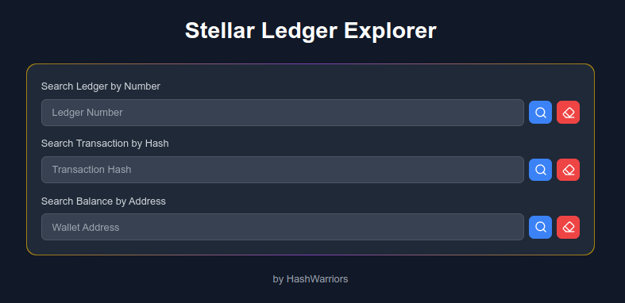

# Stellar Ledger Explorer
Project created by HashWarriors team to accomplish Nearx DOJO Stellar Week 1 challenge.
This app provides 3 types of searching on Stellar Blockchain:
- find a ledger by number
- find a transaction by hash
- find an address balance

## 🛠️ Installation
1. Install dependencies:
   ```bash
   npm install
   ```

## 🚀 Usage
1. Run the development server:
    ```bash
    npm run dev
    ```

2. Open [http://localhost:3000](http://localhost:3000) with your browser to see the result:
    